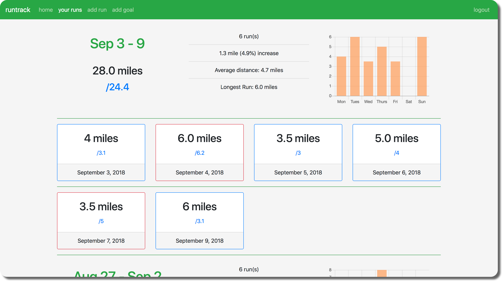

# runtrack
> A web application that keeps track of running distances, times, and goals.

[](https://travis-ci.com/horeilly1101/runtrack)
[](https://opensource.org/licenses/MIT)


## How to Use

Runtrack allows you organize your running schedule, set goals for yourself, and better understand the trends in your running data.

- First, you must create an account.
- Then, you can view your progress in the **home** tab,
- add a run in the **add run** tab,
- add a goal in the **add goal** tab,
- and view more detailed statistics in the **your runs** tab



## How to Run Locally
- Clone the repository.
- Make sure that Python 3 and pip are installed.
- Run a local PostgreSQL database with username: `postgres`, password: `password`, and port: `5555`.  (Of course, you can edit `runtrack/config.py` to change any of these details.)
- Navigate to the `runtrack` directory in your Terminal and run the following commands (on Mac):
```
$ python3 -m venv venv
$ . venv/bin/activate
$ pip install -r requirements.txt
$ export FLASK_APP=runserver.py
$ flask db upgrade
$ flask run
 ```
- Open the url `localhost:5000` in your preferred browser.

## Technologies
- Python 3 and flask to handle most of the backend features
- PostgreSQL to store data
- SQL-Alchemy to interact with the database
- Alembic to keep track of migrations
- Bootstrap4 to handle most of the front end
- Chart.js to generate and display graphs
- Heroku for web hosting